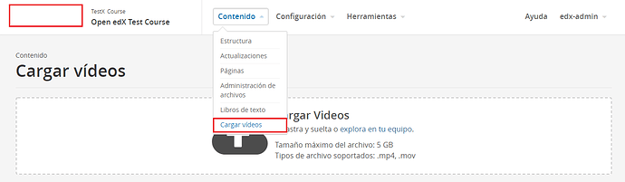
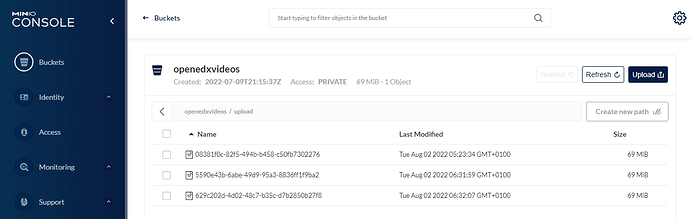

Videoupload plugin for `Tutor <https://docs.tutor.overhang.io>`__
===================================================================================

This plugin enables the Studio (CMS) video upload feature, so videos can be uploaded
to MinIO. Besides, you can upload poster images for uploaded videos.

.. image:: ./screenshots/03-poster-images.png
    :alt: Poster images for uploaded videos

Only uploading videos to MinIO will not be enough for a complete video pipeline. But
this will be an important starting point for an external video pipeline server, that
can pick up uploaded videos from the MinIO bucket, process them (generate different
resolutions, create an HLS encoding ladder, generate transcriptions etc., putting
generated assets back to MinIO), and making the right API calls to update the edxval
records so Studio can keep track and use them.

Installation
------------

Download and enable the plugin:

Nutmeg:

.. code-block:: bash

    pip install git+https://github.com/insad/tutor-contrib-videoupload@v14.0.0

Olive:

.. code-block:: bash

    pip install git+https://github.com/insad/tutor-contrib-videoupload@v15.0.0

.. code-block:: bash

    tutor plugins enable videoupload
    tutor config save

Rebuild the openedx image:

.. code-block:: bash

    tutor images build openedx

Set Django flag so you can upload poster images:

.. code-block:: bash

    tutor local init --limit=videoupload

Start Tutor:

.. code-block:: bash

    tutor local start -d

Configuration
-------------

- ``VIDEOUPLOAD_VEM_S3_BUCKET`` (default: "openedxvideos") - Name of video upload bucket in MinIO
- ``VIDEOUPLOAD_ROOT_PATH`` (default: "upload") - Name of upload folder inside video upload bucket

The ``VIDEOUPLOAD_*`` settings listed above may be modified by running ``tutor config save --set VIDEOUPLOAD_...=...``.

Configuring your proxy server
-----------------------------

Your proxy server must unescape both x-amz-meta-* parameters from the presigned upload url
query string, and add them to the header.

The relevant part for Apache2 inside the <VirtualHost> site configuration is:

.. code-block::

    RewriteEngine On

    RewriteMap ue int:unescape

    RewriteCond %{QUERY_STRING} (?:^|&)x-amz-meta-client_video_id=([^&]+)
    RewriteRule (.*) - [E=VIDEO_ID:${ue:%1}]
    RequestHeader set X-Amz-Meta-Client_video_id %{VIDEO_ID}e env=VIDEO_ID

    RewriteCond %{QUERY_STRING} (?:^|&)x-amz-meta-course_key=([^&]+)
    RewriteRule (.*) - [E=COURSE_KEY:${ue:%1}]
    RequestHeader set X-Amz-Meta-Course_key %{COURSE_KEY}e env=COURSE_KEY

Don't forget to restart you Apache2 webserver after:

.. code-block:: bash

    systemctl restart apache2

Reference
---------

For a bigger discussion about this plugin, troubleshooting etc., please take
a look at https://discuss.openedx.org/t/getting-video-upload-to-minio-working-in-studio/7959/2.

License
-------

This software is licensed under the terms of the AGPLv3.
